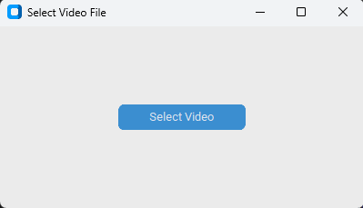
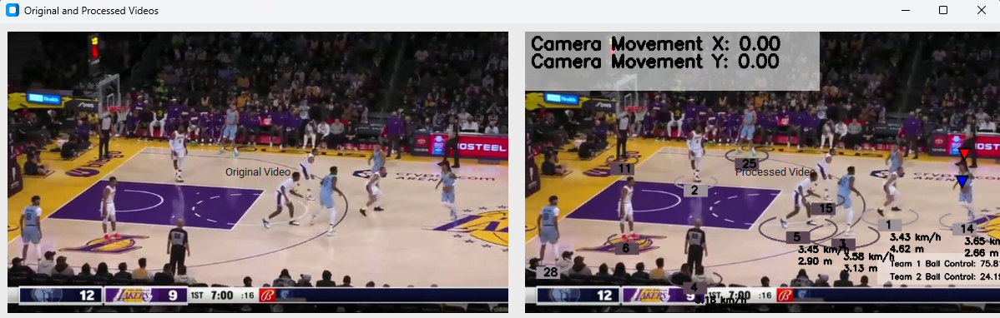

# Game Analyzer: Unleashing the Power of AI in Sports Video Analysis

## 🚀 Getting Started
### Instruction for those simply intested in downloading and running it

I have included some sample videos of football/basketball games in the 'input_video' folder, for those interested in trying out the program. 

1) install pip 
2) In the terminal, run: pip install -r requirements.txt
3) run: python main.py

at this point, a pop up window will come up. Select the video you wish to be processed and wait a little. 

  

At the end, you should get an output of this sort where you will see both the original video and the processed video: 

  

### Description of what the program does

The program 
1. **Game Type Detection:** Identifies whether the game is football or basketball and selects a specialized YOLOv8 model for object detection.

2. **Object Tracking:** Tracks objects between frames using optical flow, storing their positions for further analysis.

3. **Speed Calculation:** Calculates the speed of moving objects by adjusting for camera movement and estimating speed based on the assumption that the game takes place on a standard field size for the sport.

4. **Ball Possession Analysis:** Analyzes which team has had more possession of the ball by assigning it to the team member closest to it during the game.

### ⚠️ Known Limitations

* **Dataset Limitations:** 
    * The model struggles with detecting certain objects, particularly fast-moving balls that blur while rolling. While interpolation of ball positions has improved accuracy, it is not perfect. Better training data would help mitigate this issue.
  
* **Proof of Concept:** 
    * This implementation is currently a proof of concept and remains unoptimized. As a result, processing long videos can be time-consuming.
    * additionally, a mechanism can be implemented with stubs, in order to avoid inference on a video that has already been processed once. 
  
* **Game Type Detection Approaches:** 
    * Several methods could have been used to detect the type of game being played, each with its own drawbacks:
        * **Neural Network Training:** A neural network could be trained on images of football and basketball games, but this approach requires significant resources for data acquisition and training.
        * **Court Color Detection:** Football games generally take place on green, grass-like courts, so the game type could be inferred based on court color. However, this assumption may not hold true for all courts.
        * **Rim Detection:** Basketball courts typically have a rim, while football courts do not, so detecting a rim could indicate a basketball game. The drawback is that some courts might feature both, leading to potential misclassification.
  
    Given these trade-offs, the method that was easiest to implement was chosen. The model, already trained on a basketball dataset capable of detecting rims, was reused to simplify development.